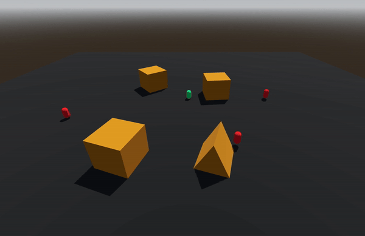

# AI-Pathfinder-Godot

This project implements an AI-Pathfinder in the Godot game engine.

This project demonstrates the application of the A* algorithm in the Godot game engine to find the shortest path between a payer(user) and enemy in a 3D environment. The project provides an interactive players of the pathfinding process, allowing users to observe how the algorithm navigates through obstacles to reach the destination.

This project showcases the implementation of the A* algorithm within the Godot game engine, enabling dynamic pathfinding between a player (user) and enemy entities within a 3D environment. The primary objective is to facilitate efficient navigation through complex terrain while providing an engaging interactive experience for users.

Utilizing the A* algorithm, the project calculates and visualizes the shortest path between the player and enemy entities, taking into account obstacles and other environmental factors.

## A* Algorithm

The A* algorithm is a pathfinding algorithm that efficiently finds the shortest path between two points on a graph. It uses a combination of the actual cost to reach a node from the start node (known as the "g-score") and an estimate of the cost to reach the goal node from the current node (known as the "h-score"). These scores are combined to determine the next node to explore, prioritizing nodes with lower total scores.

The key components of the A* algorithm include:
- **Open List:** A list of nodes to be explored, sorted by their total scores.
- **Closed List:** A list of nodes that have already been explored.
- **Heuristic Function:** An admissible and consistent function that estimates the cost from a node to the goal.
- **Cost Function:** The actual cost to reach a node from the start.

At each step, the algorithm selects the node with the lowest total score from the open list, expands it, and evaluates its neighbors. It calculates the total score for each neighbor and adds them to the open list if they have not been explored before or have a lower total score. This process continues until the goal node is reached or the open list is empty.

## Features

- **Customizable 3D Environment:** Supports the creation of custom 3D environments with obstacles and waypoints, providing flexibility in designing different maps.

- **Two Points of View (POV):** The project offers two perspectives - a top-down view for designing the map and setting waypoints, and a first-person view for observing the pathfinding process in 3D.

## Demo

### **Top-down View:**

### **First-person View:**

